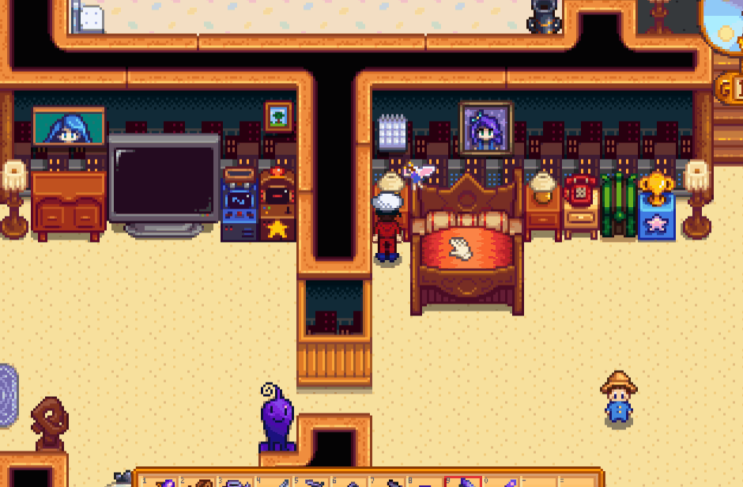

# DresserCalendar

**DresserCalendar** is a [Stardew Valley](https://stardewvalley.net) mod which lets you access a wall calendar placed
behind a furniture.

## Demo

## Install
1. Install the latest version of [SMAPI](https://smapi.io).
2. Download this mod from the [release page](https://github.com/tastytypist/DresserCalendar/releases).
3. Extract and place its contents in the game's `Mods` directory.
4. Run the game using SMAPI.

## Attributions
This project is licensed under the GPLv3 License.
